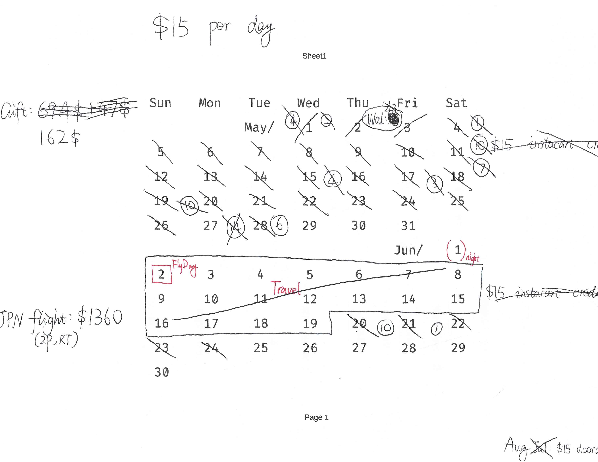

# recolic's budget tracking tool

## How does it work

认识数位版账本前, 首先你要了解它的前身, 手写budget tracking是如何work的.

 

- 如何记账

在日历上, 每天都会有一定的budget, 例如\$15. 每当你产生一笔消费, 就在日历上划去对应的天数. 例如你消费了45\$, 就需要划去三天, 表示这三天的预算被用掉了.

如果消费不能被budget整除, 例如我消费6\$买了牛肉, 不满15\$, 就在空白处写下"6"表示有6\$的消费还没被统计. 假如下次我又消费10\$买了寿司, 我就可以与之前的6\$结合起来, 划掉之前的6\$和一天的预算(15\$), 再把剩余的1\$写在旁边.

假如我有10\$消费被退款了, 但我们的表格无法回退. 没关系, 我们只需要记下"-10\$"即可, 以后消费时自然会拿来结合.

- 如何评估

现在我们已经把消费记下了, 但是如何评估我们的财务状况呢? 很简单. 只需要将日历上今天的日期, 与你已经用掉的预算日对比即可.

例如: 今天是6月22日, 但你已经划掉了6月26日的budget. 这意味着你的财务超支了, 应当考虑缩减开支.

- 特殊支出

有些支出并不是由我们的每日预算支付的. 例如: 你的房租, 水电费用, 电话费网费, 旅行机票消费, 大件数码产品. 它们有的属于"不可避免的周期性支出", 另一些属于"特事特办的意外性支出".

对于"不可避免的周期性支出", 我会经过一次审核批准, 即自动扣款, 不再计入日常预算. (显然此类支出即使计入预算也是毫无意义的); 对于"特事特办的意外性支出", 我会进行专项审批, 然后记录在日历旁边.

- 意外状况

有时我们超支了太多, 下定决心进行债务重整. 有时我们认为预算额度不合适, 决定对预算额度进行调整. 有时我们刚刚旅行归来, 在日历上留下了大片的空白.

这时候我们可以重新选定一个开始日期, 用相同或不同的额度, 开启一个新的预算周期. 这在手写账本上表现为, 很多日期被框起来, 整个划掉. 而数位版日历也具有这个功能.

- 数位化

在充分理解手写账本如何工作后, 数位版以完全相同的逻辑工作, 只是, 你不必用纸笔进行记录和计算, 而是由后端自动处理.

日历上用深色表示相应日期的预算已被使用, 而浅色表示相应日期的预算尚未使用. 你只需输入你的消费金额并提交, 而不满一天的消费会被记住并自动统计.

当你遭遇*意外情况*, 希望开启新的预算周期时, 只需点击`Start a new budget plan`, 输入相关信息即可.

> 注意! 在你开始使用前, 别忘了先创建一个预算周期哦.

- corner case: 开支何时记入系统

开支于具确定数目后之最近合理时刻记入系统。

可能发生之部分退款，视为数目之未确定。

可能发生之全额退款，视为数目已确定。

举例：Walmart已下单预付款，然配送时可能根据实际货品重量、缺货情况进行部分价格调整。此情况下应待配送完成后（即开支之数目确定后）将所确定之数目入账。  
Amazon下单后亦存在完全退款之可能，然下单时开支数目已于合理标准内几近确定，故可作为入账之根据。

## Deployment

Put `release/` into any php-enabled web server, do `chmod 777 -R deploy_dir`, and enjoy.

